# Dokumentation Swiper v1.0

## Softwaredesign
Das Program wurde mit 2 Clients realisiert, mit einem Angular-Web-Client für Benutzer und für einen WPF-Client, der für Moderatoren vorgesehen ist. Die beiden Clients kommunizieren mit einem ASP.NET Backend-Server

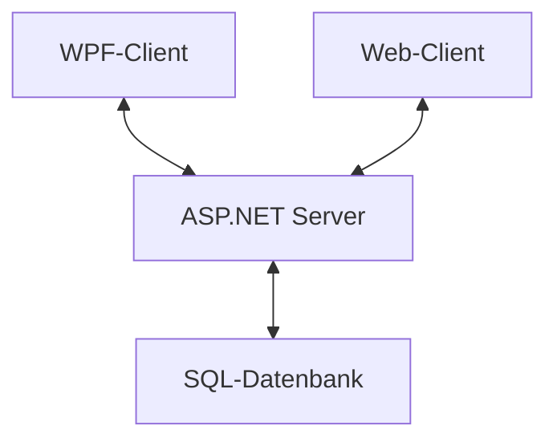

## Beschreibung der Software
Swiper ist eine Dating App, in der man sich seinen Partner bzw. seine Partnerin fürs Leben finden kann. Es basiert auf eine Swiping-Technologie, in der man durch einen Swipe nach Rechts eine Person liked, und mit einem Swipe nach links eine Person disliked.

Aus zeitlichen Gründen konnten Matches und der Chat in diesem Release nicht implementiert werden.

## Web-Client

### Registrierung
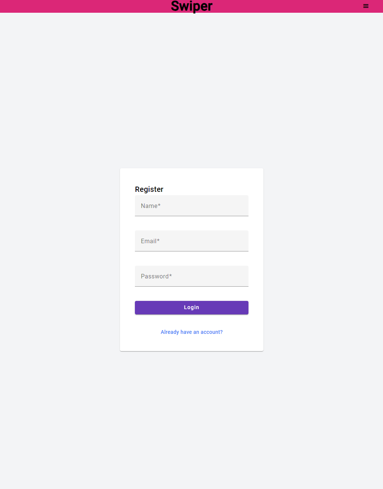
Wenn man sich einen neuen Account anlegen will, muss man einen Namen, eine Email und ein Passwort eingeben. Dabei muss eine gültige Email und ein Passwort mit mindestens 8 Zeichen, Zahlen, Groß- & Kleinbuchstaben und Sonderzeichen eingegeben werden.

### Login
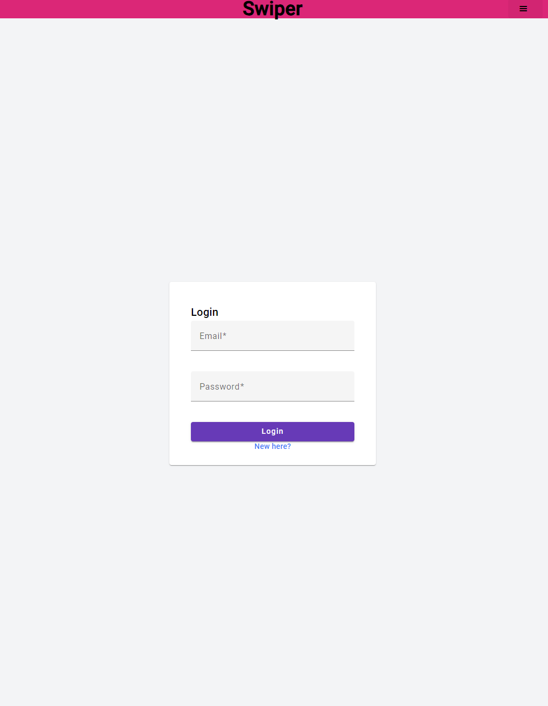
Beim Login muss man seine Email und sein Passwort eingeben.

### Swipen
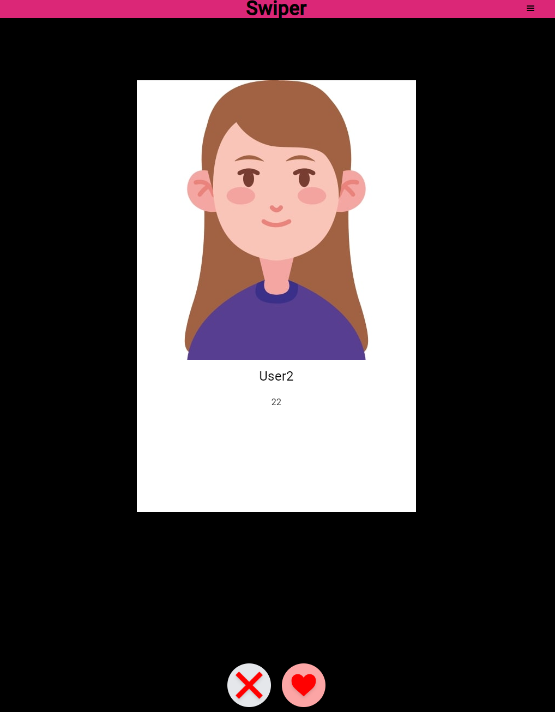
Bei der Swipe-Seite kriegt man dann die Benutzer vorgestellt. Es wird dabei das Profilbild, der Name, das Alter und der Wohnort angezeigt. Mit 2 Knöpfen kann man dabei entscheiden, ob man der Person einen Like geben will, oder nicht.

## WPF-Client

### Login
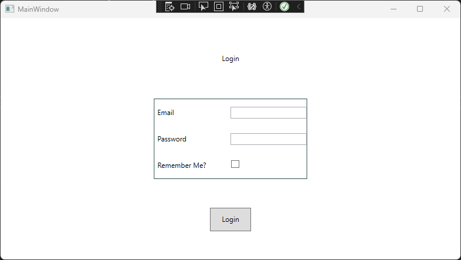
Wie im Web-Client müssen hier auch die Email und das Passwort eingegeben werden.

### User View
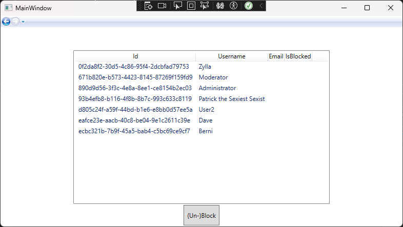
Hier sieht man alle Benutzer mit den relevantesten Daten. Es steht ein Knopf zur Verfügung, mit dem man Benutzer sperren kann.

## API Schnittstellen

### GET /Health
```cs
        public async Task<IActionResult> Health()
        {
            return Ok("Up");
        }
```
Diese Route gibt an, ob der Server online ist, oder nicht. Wenn er das ist, wird "Up" zurückgeben mit dem Statuscode 200.

### GET User
```cs
        [HttpGet(Name = "GetUsers")]
        public async Task<IActionResult> Index()
        {
            return Ok(_mapper.Map<IEnumerable<UserDTO>>(this._userManager.Users.Include(user => user.Images).ToList()));
        }
```
Diese Route gibt alle User zurück, welche in der Datenbank gespeichert sind.

### GET User/{id}
```cs
        [Authorize(Roles = "Moderator,Administrator")]
        [HttpGet("{id}")]
        public async Task<IActionResult> GetUserById(string id)
        {
            User? user = await _userManager.FindByIdAsync(id);
            if (user is null)
            {
                return BadRequest("User not found.");
            }

            return Ok(_mapper.Map<UserModDTO>(user));
        }
```
Diese Route ist nur für Moderatoren und Administratoren zugänglich und gibt den User mit der entsprechenden ID zurück.

### DELETE User/{id}
```cs
        [Authorize(Roles = "Administrator")]
        [HttpDelete("{id}")]
        public async Task<IActionResult> Delete(string id)
        {
            User? user = _context.Users.Find(id);

            if (user is null)
            {
                return BadRequest("User not found.");
            }
            ;
            if (user == (await _userManager.GetUserAsync(User)))
            {
                await _signInManager.SignOutAsync();
            }

            _context.Users.Remove(user);
            await _context.SaveChangesAsync();

            return Ok(_mapper.Map<UserModDTO>(user));
        }
```
Diese Route ist ausschließlich für Administratoren zugänglich und löscht den User mit der entsprechenden ID.

### DELETE User/
```cs
        [Authorize(Roles = "Administrator")]
        [HttpDelete]
        public async Task<IActionResult> DeleteAll()
        {
            var users = _context.Users;

            foreach (var user in users)
            {
                user.Images = null;
            }

            _context.RemoveRange(users);
            await _context.SaveChangesAsync();

            await _signInManager.SignOutAsync();

            return Ok("All users deleted!");
        }
```
Diese Route ist ausschließlich für Administratoren zugänglich und löscht alle User.

### POST User/Register
```cs
        [HttpPost("Register")]
        //[ValidateAntiForgeryToken]
        public async Task<IActionResult> Register([FromBody] UserCreationDTO userCreationDto)
        {
            if ((User is not null) && User.Identity.IsAuthenticated)
            {
                return Unauthorized("User is logged in.");
            }

            try
            {
                User user = _mapper.Map<User>(userCreationDto);

                var result = await _userManager.CreateAsync(user, userCreationDto.Password);

                if (result.Succeeded)
                {
                    await _signInManager.SignOutAsync();
                    await _signInManager.SignInAsync(user, isPersistent: true);

                    return Ok(userCreationDto);
                }

                return BadRequest("Bad: " + result.Errors.ToString());
            }
            catch
            {
                return BadRequest("Req");
            }
        }
```
Diese Route legt einen neuen Benutzer an.

### POST User/LogIn
```cs
        [HttpPost("LogIn")]
        //[ValidateAntiForgeryToken]
        public async Task<IActionResult> LogIn(string email, string password, bool rememberMe)
        {
            User? user = await _userManager.FindByEmailAsync(email);

            if (user is null)
            {
                return NotFound("User not found!"); //NotFound()
            }

            await _signInManager.SignOutAsync();
            var result = await _signInManager.PasswordSignInAsync(user, password, rememberMe, false);

            if (!result.Succeeded)
            {
                return BadRequest();
            }

            return Ok(_mapper.Map<UserDTO>(user));
        }
```
An dieser Route kann man sich mit einem User einloggen.

### POST User/LogOff
```cs
        [Authorize]
        [HttpPost("LogOff")]
        //[ValidateAntiForgeryToken]
        public async Task<IActionResult> LogOff()
        {
            await _signInManager.SignOutAsync();
            return Ok();
        }
```
Mit dieser Route kann man sich ausloggen.

### GET User/CurrentUser
```cs
        [HttpGet("CurrentUser")]
        public async Task<IActionResult> IsLoggedIn()
        {
            if ((User is not null) && User.Identity.IsAuthenticated)
            {
                var user = await _userManager.GetUserAsync(User);
                return Ok(_mapper.Map<UserDTO>(user));
            }
            return BadRequest();
        }
```
Diese Funktion gibt den aktuellen User zurück, wenn kein User vorhanden wird, wird ein Fehler zurückgegeben.

### POST User/Like
```cs
        [Authorize]
        [HttpPost("Like")]
        public async Task<IActionResult> Like(string id)
        {
            if ((User is not null) && !User.Identity.IsAuthenticated)
            {
                return Unauthorized("User is not logged in");
            }

            User? target = await _userManager.FindByIdAsync(id);

            if (target is null)
            {
                return BadRequest("Target does not exist!");
            }

            User? user = await _userManager.GetUserAsync(User);

            if (user == target)
            {
                return BadRequest("User cannot like themselves!");
            }

            if (user.LikedUsers is null)
            {
                user.LikedUsers = new List<User>();
            }

            if (user.LikedUsers.Contains(target))
            {
                return BadRequest("User is already liked!");
            }

            user.LikedUsers.Add(target);

            await _userManager.UpdateAsync(user);

            return Ok("User is liked now.");
        }
```
Diese Route lässt einen Benutzer einen anderen Liken.

### GET User/Matches
```cs
        [Authorize]
        [HttpGet("Matches")]
        public async Task<IActionResult> GetMatches()
        {
            if ((User is not null) && !User.Identity.IsAuthenticated)
            {
                return Unauthorized("User is not logged in");
            }

            //User? user = await _userManager.GetUserAsync(User);
            User? user = this._userManager.Users.Include(user => user.LikedUsers).ToListAsync().Result.Find(u => User.Identity.Name == u.UserName);
            if (user is null)
            {
                return BadRequest("User is not logged in!");
            }

            if (user.LikedUsers is null)
            {
                user.LikedUsers = new List<User>();
                await _userManager.UpdateAsync(user);
                return Ok(user.LikedUsers);
            }

            List<User> matches = new();

            foreach (User target in user.LikedUsers)
            {
                if (target.LikedUsers is null)
                {
                    continue;
                }

                if (target.LikedUsers.Contains(user))
                {
                    matches.Add(target);
                }
            }

            return Ok(_mapper.Map<List<UserDTO>>(matches));
        }
```
Diese Funktion gibt alle Matches (gegenseitige Likes) zurück.

### POST User/ProfilePicture
```cs
        [Authorize]
        [HttpPost("ProfilePicture")]
        public async Task<IActionResult> UploadPfp(IFormFile file)
        {
            if (file is null || file.Length == 0)
            {
                return BadRequest("No image uploaded!");
            }

            User? user;
            using (var memoryStream = new MemoryStream())
            {
                file.CopyTo(memoryStream);
                byte[] imageData = memoryStream.ToArray();

                var image = new Image(imageData);

                user = await _userManager.GetUserAsync(User);
                if (user is null)
                {
                    return BadRequest("User is not logged in!");
                }

                if (user.Images is null)
                {
                    user.Images = new List<Image>();
                }

                user.Images.Add(image);
            }

            await _userManager.UpdateAsync(user);

            user = await _userManager.FindByIdAsync(user.Id);

            return Ok(_mapper.Map<UserDTO>(user));
        }
```
Diese Funktion lässt Benutzer Profilbilder herunterladen.

### GET Block/{id}
```cs
        [Authorize(Roles = "Moderator,Administrator")]
        [HttpGet("Block/{id}")]
        public async Task<IActionResult> BlockUser(string id)
        {
            User? user = await _userManager.FindByIdAsync(id);

            if(user is null)
            {
                return NotFound();
            }

            user.IsBlocked = true;
            await _userManager.UpdateAsync(user);

            return Ok(_mapper.Map<UserModDTO>(user));
        }
```
Diese Route ist nur für Administratoren oder Moderatoren zugänglich und sie sperrt den Benutzer mit der entsprechenden ID.

## Weitere Technologien

### NTypeWriter
NTypeWriter ist eine Visual Studio Extension, mithilfe der man C# Dateien in andere Dateien umwandeln kann. Im Projekt wird NTypeWriter verwendet, um DTOs aus dem Backend in das Frontend zu übertragen, ohne dass man diese manuell kopieren muss. Dazu benötigt man lediglich eine Template-Datei, welche mit .nt endet. Diese Datei gibt an, was NTypeWriter mit den angegebenen Dateien machen soll.

Diese Template Datei generiert aus DTOs vom Backend DTOs im Frontend:

``` cs
{{- for dto in data.Classes | Symbols.WhereNamespaceStartsWith "Swiper.Server" | Symbols.WhereNameEndsWith "DTO"
        capture output
-}}

{{~  for dependency in dto | Type.AllReferencedTypes }}
import { {{ dependency.BareName }} } from "./{{ dependency.BareName }}";
{{- end }}

export class {{ dto.Name }} {{- if dto.HasBaseClass }} extends {{ dto.BaseClass.Name; end }}
{ 
{{- for prop in dto.Properties }}
    {{ prop.Name | String.ToCamelCase }}: {{ prop.Type | Type.ToTypeScriptType }};   
{{- end }}

    constructor({{- for prop in dto.Properties }}{{ prop.Name | String.ToCamelCase }}?: {{ prop.Type | Type.ToTypeScriptType }},{{- end }})
    {
    {{  if dto.HasBaseClass }}    super(); {{-end }}
    {{- for prop in dto.Properties }}
        this.{{ prop.Name | String.ToCamelCase }} = {{prop.Name | String.ToCamelCase }} ?? {{ prop.Type | Type.ToTypeScriptDefault }};
    {{- end }}
    }
}
{{-     end
   Save output ("generatedTypes/" + dto.BareName + ".ts")
   end 
}}
```
Dann muss man nur noch in der Datei mit der rechten Maustaste das Kontextmenü öffnen und `Render Template` drücken. Dies könnte man auch beim Start des Projekts automatisieren, darauf wurde jedoch aufgrund des kleinen Rahmen dieses Projekts verzichtet.

### AutoMapper
Mithilfe von AutoMapper kann man seine Entitäten ganz einfach in DTOs umwandeln. Einzig dafür benötigt man eine Klasse, in der man alle Umwandlungen definiert.

#### MappingProfiles.cs:
```cs
    public class MappingProfiles : Profile
    {
        public MappingProfiles() 
        {
            this.CreateMap<User, UserDTO>();
            this.CreateMap<UserDTO, User>();

            this.CreateMap<UserCreationDTO, User>();

            this.CreateMap<UserModDTO, User>();
            this.CreateMap<User, UserModDTO>();

            this.CreateMap<Image, ImageDTO>();
            this.CreateMap<ImageDTO, Image>();
        }
    }
```

Die Umwandlung erfolgt dann wie hier beispielsweise in der /Users/{id} Route:

```cs
        [Authorize(Roles = "Moderator,Administrator")]
        [HttpGet("{id}")]
        public async Task<IActionResult> GetUserById(string id)
        {
            User? user = await _userManager.FindByIdAsync(id);
            if (user is null)
            {
                return BadRequest("User not found.");
            }

            return Ok(_mapper.Map<UserModDTO>(user));
        }
```
Mit dem Aufruf der Funktion Map spart man sich das manuelle umwandeln von Entitäten und DTOs, was zum einen Zeit spart und zum anderen hat man einen viel kürzeren, schöneren und vor allem viel lesbareren Code.

### Swagger
Swagger ist eine Technologie, welche die Routen visualisiert und eine UI zur Verfügung stellt, mithilfe der man die Routen ganz einfach testen kann. Swagger ist in ASP.NET eingebaut und kann mit folgenden 2 Zeilen in `Program.cs` eingebunden werden:

```cs
                app.UseSwagger();
                app.UseSwaggerUI();
```

Danach kann man Swagger im Browser über die URL `https://localhost:7281/swagger/index.html` öffnen.
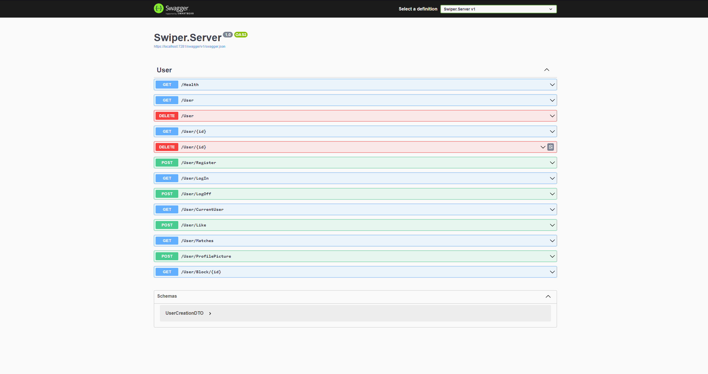

## Diagramme
### User:
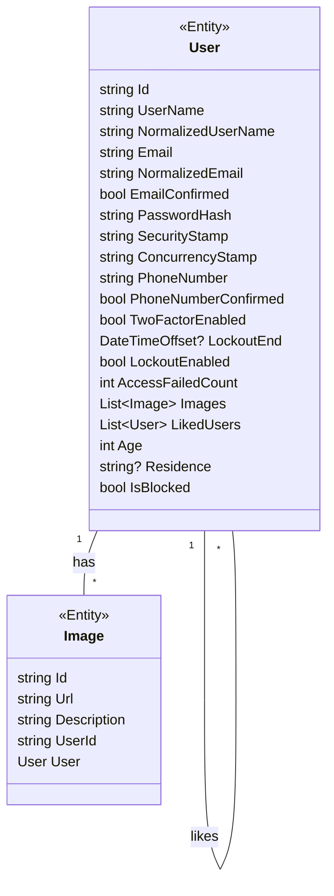

### Klassendiagramme DTOs:
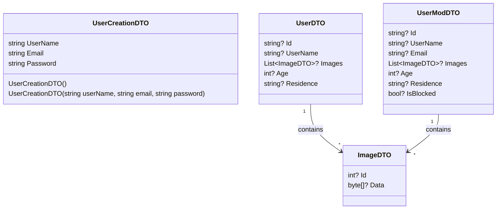

### Objektdiagram Testdaten:
```mermaid
classDiagram
    class User {
        UserName: string
        Email: string
        Residence: string
        Age: int
    }

    class Dave {
        UserName = "Dave"
        Email = "user1@mail.com"
        Residence = "Saalfelden"
        Age = 18
    }

    class User2 {
        UserName = "User2"
        Email = "user2@mail.com"
        Residence = "Salzburg"
        Age = 22
    }

    class Patrick {
        UserName = "Patrick the Sexiest Sexist"
        Email = "user3@mail.com"
        Residence = "Voglau"
        Age = 18
    }

    class Moderator {
        UserName = "Moderator"
        Email = "moderator@mail.com"
        Residence = "Fugging"
        Age = 35
    }

    class Administrator {
        UserName = "Administrator"
        Email = "administrator@mail.com"
        Residence = "Golling"
        Age = 60
    }

    class Berni {
        UserName = "Berni"
        Email = "bernhard.pirchner@mail.com"
        Residence = "Niedernfritz City"
        Age = 18
    }

    class Zylla {
        UserName = "Zylla"
        Email = "tobias.ziller@mail.com"
        Residence = "Annaberg"
        Age = 18
    }
```

### Login-Sequenzdiagramm:
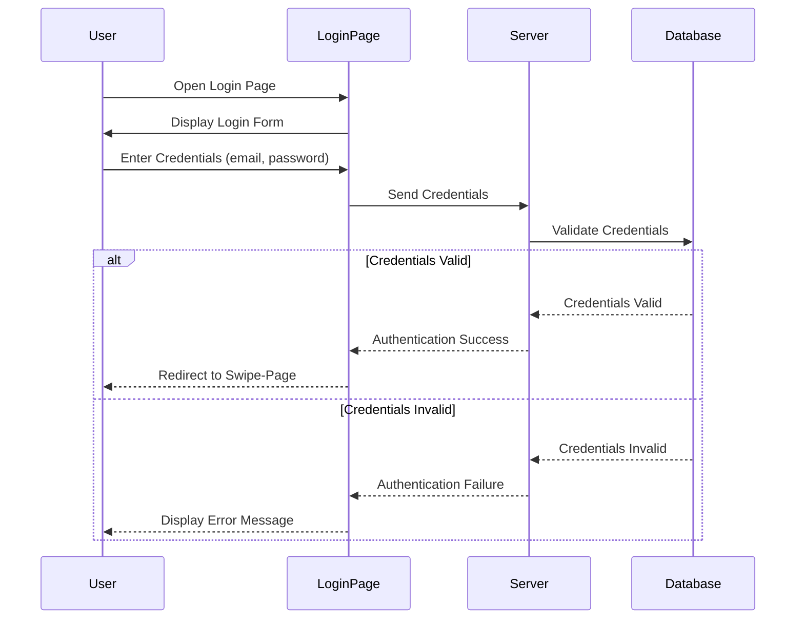

### Registrierung-Sequenzdiagramm:
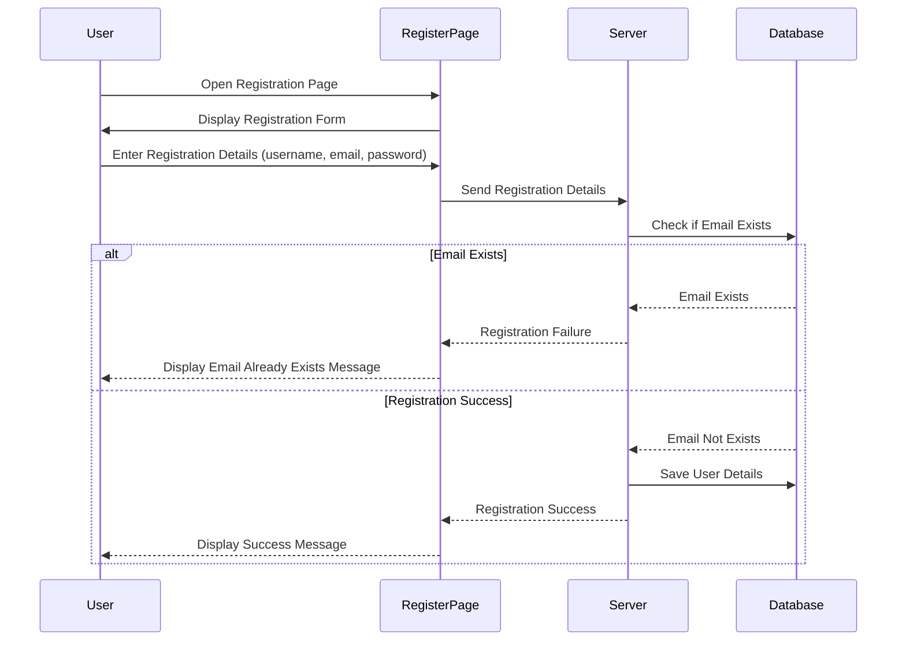

## Diskussion der Ergebnisse
Das Produkt verfügt über eine Ansprechende GUI, über die man mithilfe von Swiping andere Benutzer likes geben kann.

Für Moderatoren wird eine Desktop-GUI zu Verfügung gestellt, in der alle Benutzerdaten visualisiert werden und in der Moderatoren Benutzer sperren können.

## Quellenverzeichnis

### Backend-Server
#### [ASP.NET](https://dotnet.microsoft.com/en-us/apps/aspnet)
#### [EntityFramework](https://learn.microsoft.com/de-de/ef/core/)
#### [Identity](https://learn.microsoft.com/de-de/aspnet/identity/overview/getting-started/introduction-to-aspnet-identity)

### Web-Client
#### [Angular](https://angular.dev)
#### [TypeScript](https://www.typescriptlang.org)

### WPF-Client
#### [C#](https://learn.microsoft.com/de-de/dotnet/csharp/)
#### [WPF](https://learn.microsoft.com/de-de/dotnet/desktop/wpf/overview/?view=netdesktop-8.0)

### Sonstige
#### [NTypeWriter](https://github.com/NeVeSpl/NTypewriter)
#### [AutoMapper](https://automapper.org)
