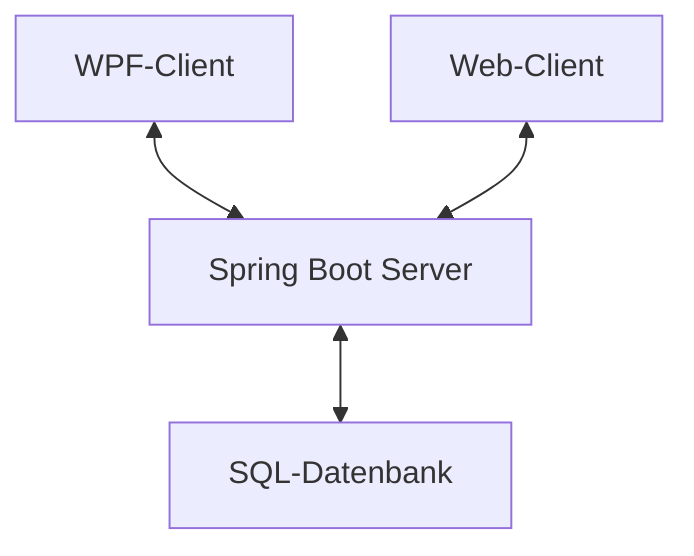

# Dokumentation Swiper

## Softwaredesign
Das Program wurde mit 2 Clients realisiert, mit einem Angular-Web-Client für Benutzer und für einen WPF-Client, der für Moderatoren vorgesehen ist. Die beiden Clients kommunizieren mit einem ASP.NET Backend-Server



## Beschreibung der Software
Swiper ist eine Dating App, in der man sich seinen Partner bzw. seine Partnerin fürs Leben finden kann. Es basiert auf eine Swiping-Technologie, in der man durch einen Swipe nach Rechts eine Person liked, und mit einem Swipe nach links eine Person disliked.

## API (Backend)

### GET /Health
```cs
        public async Task<IActionResult> Health()
        {
            return Ok("Up");
        }
```
Diese Route gibt an, ob der Server online ist, oder nicht. Wenn er das ist, wird "Up" zurückgeben mit dem Statuscode 200.

### GET User
```cs
        [HttpGet(Name = "GetUsers")]
        public async Task<IActionResult> Index()
        {
            return Ok(_mapper.Map<IEnumerable<UserDTO>>(this._userManager.Users.Include(user => user.Images).ToList()));
        }
```
Diese Route gibt alle User zurück, welche in der Datenbank gespeichert sind.

### GET User/{id}
```cs
        [HttpGet("{id}")]
        public async Task<IActionResult> GetUserById(string id)
        {
            User? user = await _userManager.FindByIdAsync(id);
            if (user is null)
            {
                return BadRequest("User not found.");
            }

            return Ok(_mapper.Map<UserDTO>(user));
        }
```
Diese Route gibt den User mit der entsprechenden ID zurück.

### DELETE User/{id}
```cs
        [HttpDelete("{id}")]
        public async Task<IActionResult> Delete(string id)
        {
            User? user = _context.Users.Find(id);

            if (user is null)
            {
                return BadRequest("User not found.");
            }
            ;
            if (user == (await _userManager.GetUserAsync(User)))
            {
                await _signInManager.SignOutAsync();
            }

            _context.Users.Remove(user);
            await _context.SaveChangesAsync();

            return Ok(_mapper.Map<UserDTO>(user));
        }
```
Diese Route löscht den User mit der entsprechenden ID.

### DELETE User/
```cs
        [HttpDelete]
        public async Task<IActionResult> DeleteAll()
        {
            var users = _context.Users;

            foreach (var user in users)
            {
                user.Images = null;
            }

            _context.RemoveRange(users);
            await _context.SaveChangesAsync();

            await _signInManager.SignOutAsync();

            return Ok("All users deleted!");
        }
```
Diese Route löscht alle User.

### POST User/Register
```cs
        [HttpPost("Register")]
        //[ValidateAntiForgeryToken]
        public async Task<IActionResult> Register([FromBody] UserCreationDTO userCreationDto)
        {
            if ((User is not null) && User.Identity.IsAuthenticated)
            {
                return Unauthorized("User is logged in.");
            }

            try
            {
                User user = _mapper.Map<User>(userCreationDto);

                var result = await _userManager.CreateAsync(user, userCreationDto.Password);

                if (result.Succeeded)
                {
                    await _signInManager.SignOutAsync();
                    await _signInManager.SignInAsync(user, isPersistent: true);

                    return Ok(userCreationDto);
                }

                return BadRequest("Bad: " + result.Errors.ToString());
            }
            catch
            {
                return BadRequest("Req");
            }
        }
```
Diese Route legt einen neuen Benutzer an.

### POST User/LogIn
```cs
        [HttpPost("LogIn")]
        //[ValidateAntiForgeryToken]
        public async Task<IActionResult> LogIn(string email, string password, bool rememberMe)
        {
            User? user = await _userManager.FindByEmailAsync(email);

            if (user is null)
            {
                return NotFound("User not found!"); //NotFound()
            }

            await _signInManager.SignOutAsync();
            var result = await _signInManager.PasswordSignInAsync(user, password, rememberMe, false);

            if (!result.Succeeded)
            {
                return BadRequest();
            }

            return Ok(_mapper.Map<UserDTO>(user));
        }
```
An dieser Route kann man sich mit einem User einloggen.

### POST User/LogOff
```cs
        [HttpPost("LogOff")]
        //[ValidateAntiForgeryToken]
        public async Task<IActionResult> LogOff()
        {
            await _signInManager.SignOutAsync();
            return Ok();
        }
```
Mit dieser Route kann man sich ausloggen.

### GET User/CurrentUser
```cs
        [HttpGet("CurrentUser")]
        public async Task<IActionResult> IsLoggedIn()
        {
            if ((User is not null) && User.Identity.IsAuthenticated)
            {
                var user = await _userManager.GetUserAsync(User);
                return Ok(_mapper.Map<UserDTO>(user));
            }
            return BadRequest();
        }
```
Diese Funktion gibt den aktuellen User zurück, wenn kein User vorhanden wird, wird ein Fehler zurückgegeben.

### POST User/Like
```cs
        [HttpPost("Like")]
        public async Task<IActionResult> Like(string id)
        {
            if ((User is not null) && !User.Identity.IsAuthenticated)
            {
                return Unauthorized("User is not logged in");
            }

            User? target = await _userManager.FindByIdAsync(id);

            if (target is null)
            {
                return BadRequest("Target does not exist!");
            }

            User? user = await _userManager.GetUserAsync(User);

            if (user == target)
            {
                return BadRequest("User cannot like themselves!");
            }

            if (user.LikedUsers is null)
            {
                user.LikedUsers = new List<User>();
            }

            if (user.LikedUsers.Contains(target))
            {
                return BadRequest("User is already liked!");
            }

            user.LikedUsers.Add(target);

            await _userManager.UpdateAsync(user);

            return Ok("User is liked now.");
        }
```
Diese Route lässt einen Benutzer einen anderen Liken.

### GET User/Matches
```cs
        [HttpGet("Matches")]
        public async Task<IActionResult> GetMatches()
        {
            if ((User is not null) && !User.Identity.IsAuthenticated)
            {
                return Unauthorized("User is not logged in");
            }

            //User? user = await _userManager.GetUserAsync(User);
            User? user = this._userManager.Users.Include(user => user.LikedUsers).ToListAsync().Result.Find(u => User.Identity.Name == u.UserName);
            if (user is null)
            {
                return BadRequest("User is not logged in!");
            }

            if (user.LikedUsers is null)
            {
                user.LikedUsers = new List<User>();
                await _userManager.UpdateAsync(user);
                return Ok(user.LikedUsers);
            }

            List<User> matches = new();

            foreach (User target in user.LikedUsers)
            {
                if (target.LikedUsers is null)
                {
                    continue;
                }

                if (target.LikedUsers.Contains(user))
                {
                    matches.Add(target);
                }
            }

            return Ok(_mapper.Map<List<UserDTO>>(matches));
        }
```
Diese Funktion gibt alle Matches (gegenseitige Likes) zurück.

### POST User/ProfilePicture
```cs
        [HttpPost("ProfilePicture")]
        public async Task<IActionResult> UploadPfp(IFormFile file)
        {
            if (file is null || file.Length == 0)
            {
                return BadRequest("No image uploaded!");
            }

            User? user;
            using (var memoryStream = new MemoryStream())
            {
                file.CopyTo(memoryStream);
                byte[] imageData = memoryStream.ToArray();

                var image = new Image(imageData);

                user = await _userManager.GetUserAsync(User);
                if (user is null)
                {
                    return BadRequest("User is not logged in!");
                }

                if (user.Images is null)
                {
                    user.Images = new List<Image>();
                }

                user.Images.Add(image);
            }

            await _userManager.UpdateAsync(user);

            user = await _userManager.FindByIdAsync(user.Id);

            return Ok(_mapper.Map<UserDTO>(user));
        }
```
Diese Funktion lässt Benutzer Profilbilder herunterladen.

## Diagramme

## Diskussion der Ergebnisse

## Quellenverzeichnis

## Frontend

## Backend

